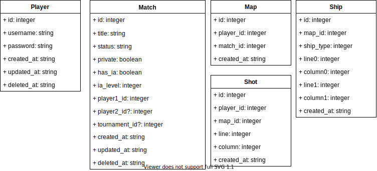

<p align="center">

<h2 align="center"><strong align="center">Back end</strong></h2>
</p>

## [Check our Front end](https://github.com/alicecabral/naval-battle-game-frontend)

## Members

- [alicecabral](https://github.com/alicecabral)
- [axell-brendow](https://github.com/axell-brendow)
- [HRKings](https://github.com/HRKings)
- [Henrique-Temponi](https://github.com/Henrique-Temponi)

## Technologies

<a href="https://www.docker.com/"></a>

<a href="https://www.postgresql.org/"></a>

<a href="https://laravel.com/"></a>

<a href="https://github.com/tymondesigns/jwt-auth"></a>

<a href="https://github.com/laravel/echo"></a>

<a href="https://laravel.com/docs/7.x/broadcasting"></a>

## Use cases diagram


## Classes diagram



## Relations

```
1 Player        belongs to    0..N Tournament
1 Tournament    has           0..N Player

1 Player        belongs to    0..N Match
1 Match         has           2    Player

1 Player        has           0..N Map
1 Map           belongs to    1    Player

1 Player        has           0..N Shot
1 Shot          belongs to    1    Player

1 Tournament    has           0..N Match
1 Match         belongs to    0..1 Tournament

1 Match         has           2    Map
1 Map           belongs to    1    Match

1 Map           has           0..N Shot
1 Shot          belongs to    1    Map

1 Map           has           0..N Ship
1 Ship          belongs to    1    Map

1 Player        belongs to    1    GlobalRanking
1 GlobalRanking has           0..N Player
```
